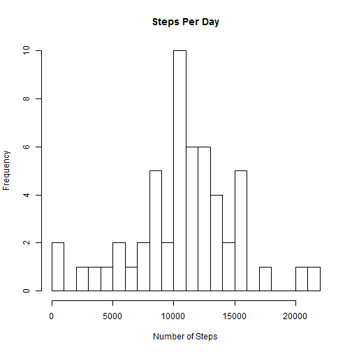
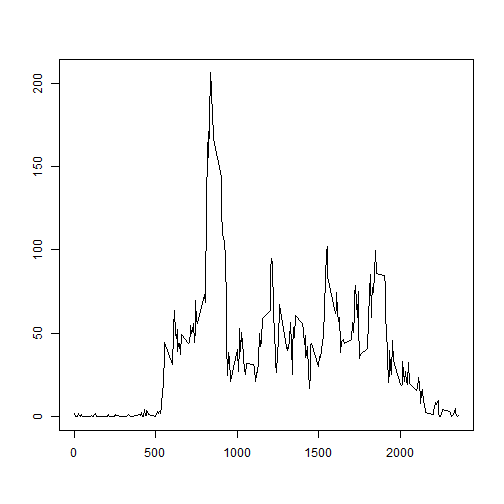
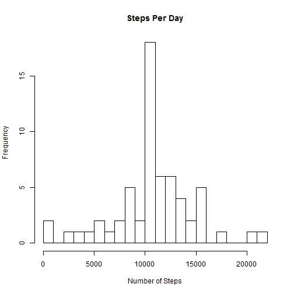
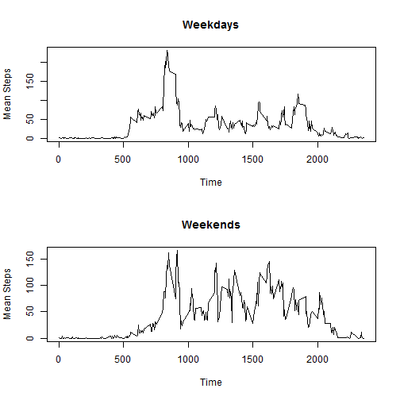

## Reproducible Research - Peer Assessment 1
#### Martha Gal

This assignment analyzes data from a personal activity monitoring device (such as Fitbit, Nike Fuelband, etc.). This
device collects data at 5 minute intervals through out the day. The data consists of two months of data from an 
anonymous individual collected during the months of October and November of 2012, and include the number of steps taken 
in 5 minute intervals each day.


### Loading and preprocessing the data

In this analysis, the lubridate and plyr functions are used. The lubridate function is used to change the date in the
activity data set from a factor to a date. The plyr function is used for group by calculations.


```r
library(lubridate)
library(plyr)
```

The activity file is read in and the format of the date field is modified to a POSIXct using lubridate.


```r
activity <- read.csv("activity.csv")
activity$date <- mdy(activity$date)
```

### Analysis of the mean number of steps per day

Using the ddply function from the plyr package, the number of steps are summarized by date. The below histogram then shows
the different values of the total steps per day.


```r
stepTotals <- ddply(activity,~date,summarise,stepSum=sum(steps))
hist(stepTotals$stepSum, breaks = 25, main = "Steps Per Day", xlab="Number of Steps")
```

 

The mean total steps per day is 10766.19 and the median total steps per day is 10765.


```r
mean <- mean(stepTotals$stepSum, na.rm=TRUE)
median <- median(stepTotals$stepSum, na.rm=TRUE)

mean
```

```
## [1] 10766.19
```

```r
median
```

```
## [1] 10765
```


### Analysis of the average daily activity pattern

The mean number of steps per time interval can also be calculated using ddply.


```r
stepIntervals <- na.omit(activity)
stepIntervals <- ddply(stepIntervals,~interval,summarise,stepSum=mean(steps))
```

Once these have been calculated, we can create a line plot to show how activity varies over the course of a day. As
one might expect, there is less activity in the late evening and early morning, with more when one might expect the
individual to be awake. On average, activity peaks mid-morning.


```r
plot(stepIntervals$interval, stepIntervals$stepSum, type="n", ylab = "", xlab="")
lines(stepIntervals$interval, stepIntervals$stepSum)
```

 

More specificially, we can see that the aforementioned peak occurs at 8:35am.


```r
max <- which.max(stepIntervals[,2])
maxInterval <- stepIntervals[max,]
highestInterval <- maxInterval$interval
highestInterval
```

```
## [1] 835
```

### Inputting Missing Values

In total, there are missing values for 2304 observations in this data set. 


```r
totalNA <- sum(is.na(activity$steps))
totalNA
```

```
## [1] 2304
```

For these missing values, the average for that particular time interval was assigned to replace 'NA' as the number of 
steps.


```r
activityNew <- activity

for (i in 1:nrow(activityNew)) {
  if (is.na(activityNew$steps[i])) {
    activityNew$steps[i] <- stepIntervals[which(activityNew$interval[i] == stepIntervals$interval), ]$stepSum
  }
}
```

This results in 0 missing values.


```r
totalNA <- sum(is.na(activityNew$steps))
totalNA
```

```
## [1] 0
```

The below histogram again shows the total number of steps per day, this time with the missing values imputed.


```r
stepTotalsNew <- ddply(activityNew,~date,summarise,stepSum=sum(steps))
hist(stepTotalsNew$stepSum, breaks = 25, main = "Steps Per Day", xlab="Number of Steps")
```

 

Once the average values of the intervals are imputed for missing values, the mean and the median are the same, 10766.19.


```r
newMean <- mean(stepTotalsNew$stepSum, na.rm=TRUE)
newMedian <- median(stepTotalsNew$stepSum, na.rm=TRUE)

newMean
```

```
## [1] 10766.19
```

```r
newMedian
```

```
## [1] 10766.19
```

### Differences in activity patterns between weekends and weekdays

To see whether activity is different on weekends versus weekdays, a new column is added that defines which type of day
each row represents. This is done using the weekdays function to assign the day of the week, and then subsetting by the
resulting day to define "weekday" and "weekend". The column is then set as a factor.


```r
activityNew$weekdays <- weekdays(activityNew$date)
activityNew$wkdys <- "weekday"
activityNew$wkdys[activityNew$weekdays == "Saturday"] <- "weekend"
activityNew$wkdys[activityNew$weekdays == "Sunday"] <- "weekend"
activityNew$wkdys <- as.factor(activityNew$wkdys)
activityNew$weekdays <- NULL
```

Separate datasets are then created for weekends and for weekdays. The ddply function calculates the mean steps in each
interval for these new datasets.


```r
stepIntervalsWeekdays <- subset(activityNew, wkdys == "weekday")
stepIntervalsWeekends <- subset(activityNew, wkdys == "weekend")

stepIntervalsWeekdays <- ddply(stepIntervalsWeekdays,~interval,summarise,stepMean=mean(steps))
stepIntervalsWeekends <- ddply(stepIntervalsWeekends,~interval,summarise,stepMean=mean(steps))
```

The below plots compare the weekday and weekend activity in each interval. We can see that on weekdays, there is a high
peak early in the day, while on the weekends, the level of activity spikes throughout the day.


```r
par(mfrow = c(2,1))

plot(stepIntervalsWeekdays$interval, stepIntervalsWeekdays$stepMean, type="n", ylab = "Mean Steps", xlab="Time", 
     main="Weekdays")
lines(stepIntervalsWeekdays$interval, stepIntervalsWeekdays$stepMean)

plot(stepIntervalsWeekends$interval, stepIntervalsWeekends$stepMean, type="n", ylab = "Mean Steps", xlab="Time",
     main="Weekends")
lines(stepIntervalsWeekends$interval, stepIntervalsWeekends$stepMean)
```

 


